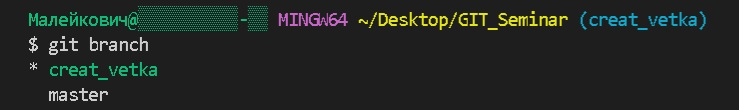
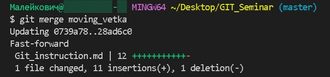
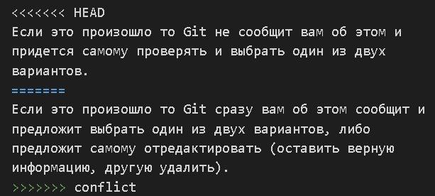
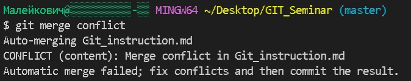
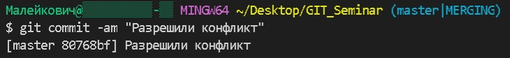
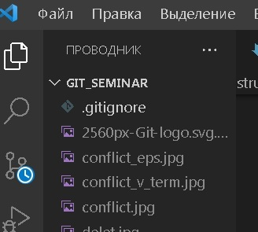
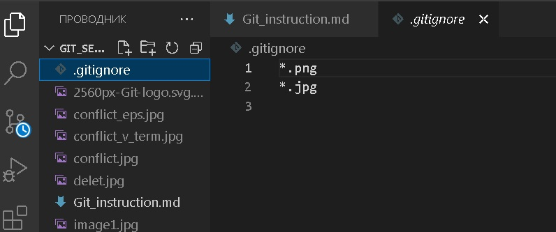

# Репозиторий для **pull request**
* В своём аккаунте на GitHub создать копию репозитория **"AndreyBulgakov19
/SCV_Git_0809"** с помощью кнопки **"Fork"**.
---
* Клонировать копию репозитория на локальный компьютер.
---
* Создать новую ветку.
---
* Добавить файл с инструкцией в новую ветку.
---
* Дополнить инструкцию разделами по работе с удалёнными репозиториями, pull request.
---
* Зафиксировать изменения (коммиты).
---
* Отправить изменения на GitHub.
---
* На сайте GitHub выполнить **Pull request**.
---

___
___
___
# Инструкция (исп. Малейкович М. А)


# Работа с GIT

## 1. Проверка наличия установленного Git
В терминале выполнить команду `git version`. 
Если Git установлен, то появится сообщение с информацией о версии программы, иначе появится сообщение об ошибке.

## 2. Установка Git
Загружаем последнюю версию Git с сайта https://git-scm.com/downloads.
Устанавливаем с настройками по умолчанию.git

## 3. Настройка Git
При первом использовании необходимо представиться. Для этого нужно ввести в терминале две команды:
```
git config --global user.name «Ваше имя английскими буквами»  
git config --global user.email ваша почта@example.com`
```

## 4. Инициализация репозитория
После проведенных настроек необходимо открыть предварительно созданную папку, в которой и будем создать записывать и сохранять наши действия. Для этого нажать меню *файл*-*открыть папку*. После чего в терминале ввести комманду:
```
git init
```
Также необходимо ввести команду `git status` чтобы убедиться что наш репозиторий создан.

Далее в проводнике нажимаем правой кнопкой мышки и выбираем __создать файл__.

## 5. Добавление в остлеживание и сохранение
Для того чтобы все наши действия отслеживались необходимо добавить новые записи и изменения в наш репозиторий командой 
```
git add имя папки,
```
а затем для сохранения ввести команду
```
git commit -m "комментарий, рассказывающий что    изменено или сделано".
```
## 6. Просмотр истории сохранений и перемещение между ними
В программе GIT есть удобные функции, ниже перечислены некоторые из них:

1. Смотреть список сохранений.
   + Выводится командой `git log --oneline`

   Пример: 

*6efe65f Добавили описание пункта 4*

*23cadd5 Добавили подзаголово 4*

*76be7f1 Добавили подзаголовок 3*

Так будет выглядеть список всех сохранений (коммитов).

2. Перемещаться между сохранениями.
   +  Выполняется командой `git checkout *номер строки с тем сохранением, в которое нужно перейти*

   Пример:
```
   git checkout 76be7f1
   ```
   и далее мы перейдем в сохранение **Добавили подзаголовок 3** 

 3. Возврат в рабочее место из любого сохранения.
    + Выполняется двумя командами
        - `git checkout master`, где `master` - это название основной ветки.
        - `git switch`  - возврат в рабочее состояние текущей ветки. 
  4. Посмотреть разницу между сохраненными изменениями и теми, которые еще не сохранили.
     +  Выполняется командой `git diff`   

     ## 7. Завершение

     В данной инструкции указаны основные моменты и  некоторые функции которые помогут начать работать с программой GIT:
- Проверка наличия установленного Git
- Установка Git
- Настройка Git
- Инициализация репозитория
- Добавление в остлеживание и сохранение
- Просмотр истории сохранени и перемещение между ними
---
## Спасибо за внимание! 

# Работа с ветками на примере инициализации репозитория.

Получить репозиторий можно двумя способами:
1. В терминале переходим к папке, в которой хотим создать репозиторий.

Далее выполняем команду 
```
git init
```
В исходной папке появится скрытый файл `git.git`

2. Клонировать существующий репозиторий Git из любого места. Для этого используется команда:
```
git clone название репозитория (файла)
```
# Запись изменений в репозиторий

Чтобы посмотреть состояние файлов в репозитории, необходимо выполнить команду:
```
git status
```
Чтобы начать отслеживать новый файл, необходимо выполнить команду:
```
git add имя файла с расширением
```
# Создание веток и работа с ними.
## 1. Для создания ветки необходимо ввести команду:
```
git branch <имя ветки>
```
После выполнения данной команды необходимо перейти в созданную ветку и работать в ней, для этого использовать команду:
```
git checkout <имя созданной ветки>
```
Чтобы проверить в какой ветке мы сейчас находимся, вводим команду `git branch` и видим в терминале количество созданных веток и та ветка, в которой мы находимся обозначена звездочкой __(*)__ см. фото 


## 2. Перемещение между ветками
Для того чтобы перемещаться между ветками необходимо использовать команду:
```
git checkout <имя ветки>
```
Есть еще одна команда, позволяющая переместиться сразу в созданную ветку:
```
git checkout -b <имя ветки>
```
## 3. Слияние и удаление веток
1. После того как работа в ветке выполнена и проверена необходимо произвести её слияние с соновной веткой.
Для этого необходимо переместиться в основную веткку (то есть в ту, в которую хотим добавить нашу доп ветку) и выполнить команду:
```
git merge <имя доп ветки>
``` 
После это в терминале отобразится информация о слиянии:



2.  После слияния доп ветка нам не нужна и можно ее удалить, используя команду:

```
git branch -d <имя ветки>
```
см. фото


## 4. При слиянии веток может произойти конфликт если одна и та же информация будет написано по-разному.

Если это произошло то Git сразу вам об этом сообщит и предложит выбрать один из двух вариантов, либо предложит самому отредактировать (оставить верную информацию, другую удалить). 

Конфликт в редакторе будет выглядеть так:



Конфликт в терминале будет выглядеть так:



После редактирования (разрешения кофликта) выполняем известную уже нам команду `git commit -am "комментарий ваш" и сохраняем вариант с верной информацией, при этом в терминале отобразятся не привычные нам строки:
 __ *они говорят сами за себя*.


## 5. Добавление изображений.
Программа Git позволяет также добавлять различные картинки, изображения, логотипы. Для этого используется команда:
```

```
В скобках [ ] пишется наименование картинки, а в скобках ( ) пишется имя картинки с расширеним.

Изображение находим любое необходимое и сохраняем в папку с нашим репозиторием.

После сохранения файла изображения оно появится у нас в проводнике слева в программе Git:


*Таким образом после всех указанных действий, наше изображение появится в нашем документе*

При добавлении изображений файлы изображения чаще всего не отслеживают (это может быть не только картинки, но и временные ресурсы, кеши и т.п.).

Чтобы Git их не отслеживал необходимо в проводнике создать файл `.gitignore` и в нем прописать какие файлы с каким расширением небходимо игнорировать в отслеживании:

*таким образом все файлы, добавленные в наш репозиторий, с указанными расширениям не будут индексироваться программой Git*.


                              ...продолжение следует


# Работа с удаленным репозиторием

1. Сначала создаем локальный репозиторий (это делать мы уже умеем, см. инструкцию выше).
2. Создаем аккаунт на сайте *https://github.com* (регистрация простая, через ваш e-mail)
3. Связать свой локальный репозиторий с удаленным.
4. Добавить изменения из локального репозитория в удаленный и наоборот.
5. Функции `Fork` и `Pull_Request`