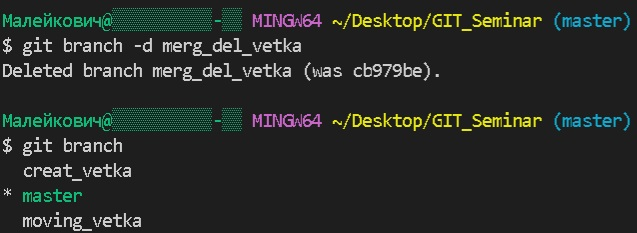
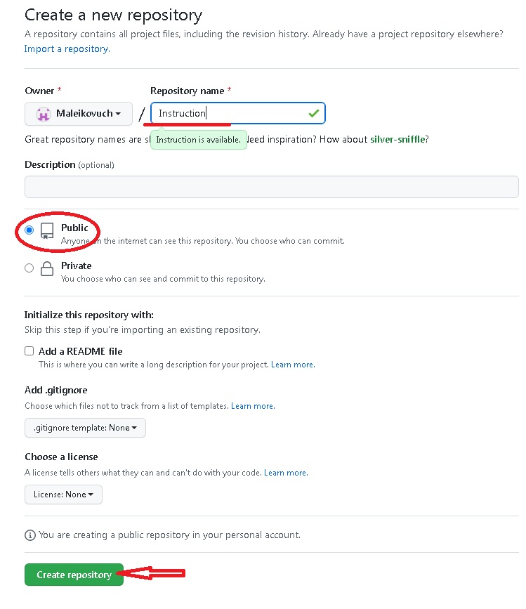
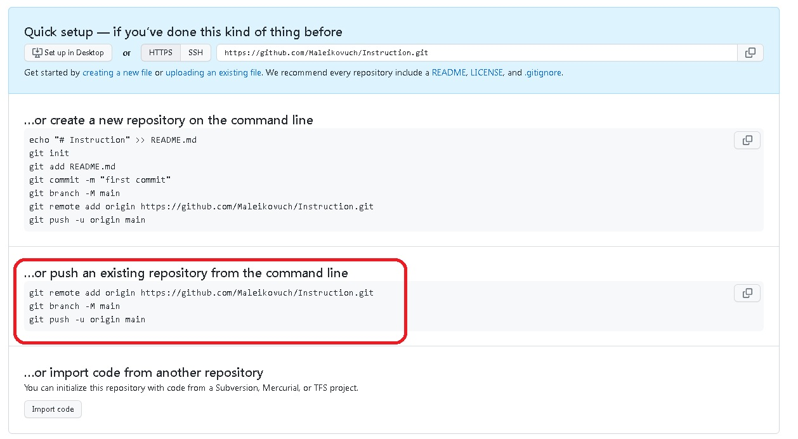
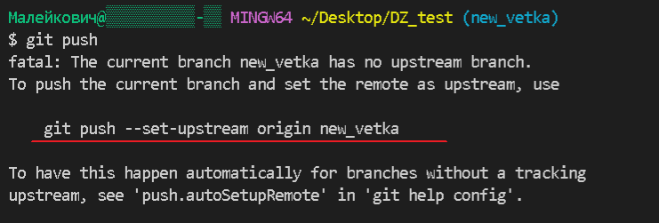
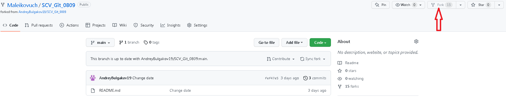
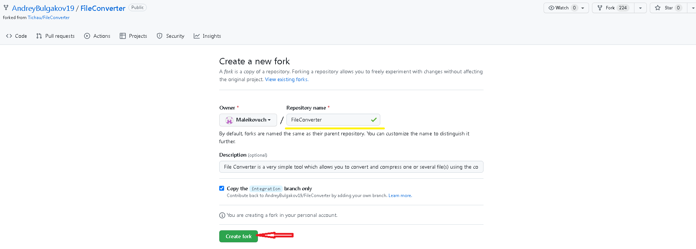
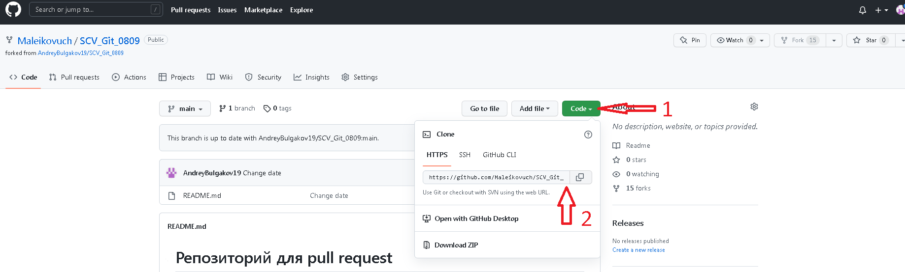
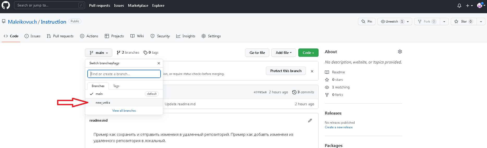
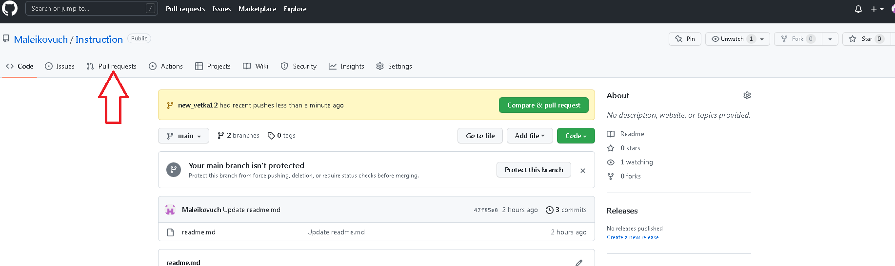
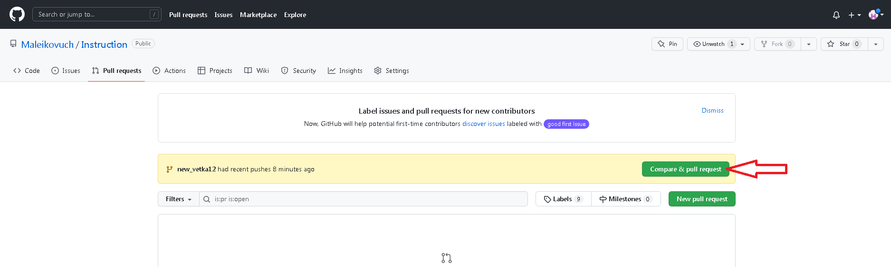

# Репозиторий для **pull request**
* В своём аккаунте на GitHub создать копию репозитория **"AndreyBulgakov19
/SCV_Git_0809"** с помощью кнопки **"Fork"**.
---
* Клонировать копию репозитория на локальный компьютер.
---
* Создать новую ветку.
---
* Добавить файл с инструкцией в новую ветку.
---
* Дополнить инструкцию разделами по работе с удалёнными репозиториями, pull request.
---
* Зафиксировать изменения (коммиты).
---
* Отправить изменения на GitHub.
---
* На сайте GitHub выполнить **Pull request**.
---

___
___
___
# Инструкция (исп. Малейкович М. А)


# Работа с GIT

## 1. Проверка наличия установленного Git
В терминале выполнить команду `git version`. 
Если Git установлен, то появится сообщение с информацией о версии программы, иначе появится сообщение об ошибке.

## 2. Установка Git
Загружаем последнюю версию Git с сайта https://git-scm.com/downloads.
Устанавливаем с настройками по умолчанию.git

## 3. Настройка Git
При первом использовании необходимо представиться. Для этого нужно ввести в терминале две команды:
```
git config --global user.name «Ваше имя английскими буквами»  
git config --global user.email ваша почта@example.com`
```

## 4. Инициализация репозитория
После проведенных настроек необходимо открыть предварительно созданную папку, в которой и будем создать записывать и сохранять наши действия. Для этого нажать меню *файл*-*открыть папку*. После чего в терминале ввести комманду:
```
git init
```
Также необходимо ввести команду `git status` чтобы убедиться что наш репозиторий создан.

Далее в проводнике нажимаем правой кнопкой мышки и выбираем __создать файл__.

## 5. Добавление в остлеживание и сохранение
Для того чтобы все наши действия отслеживались необходимо добавить новые записи и изменения в наш репозиторий командой 
```
git add имя папки,
```
а затем для сохранения ввести команду
```
git commit -m "комментарий, рассказывающий что    изменено или сделано".
```
## 6. Просмотр истории сохранений и перемещение между ними
В программе GIT есть удобные функции, ниже перечислены некоторые из них:

1. Смотреть список сохранений.
   + Выводится командой `git log --oneline`

   Пример: 

*6efe65f Добавили описание пункта 4*

*23cadd5 Добавили подзаголово 4*

*76be7f1 Добавили подзаголовок 3*

Так будет выглядеть список всех сохранений (коммитов).

2. Перемещаться между сохранениями.
   +  Выполняется командой `git checkout *номер строки с тем сохранением, в которое нужно перейти*

   Пример:
```
   git checkout 76be7f1
   ```
   и далее мы перейдем в сохранение **Добавили подзаголовок 3** 

 3. Возврат в рабочее место из любого сохранения.
    + Выполняется двумя командами
        - `git checkout master`, где `master` - это название основной ветки.
        - `git switch`  - возврат в рабочее состояние текущей ветки. 
  4. Посмотреть разницу между сохраненными изменениями и теми, которые еще не сохранили.
     +  Выполняется командой `git diff`   

     ## 7. Завершение

     В данной инструкции указаны основные моменты и  некоторые функции которые помогут начать работать с программой GIT:
- Проверка наличия установленного Git
- Установка Git
- Настройка Git
- Инициализация репозитория
- Добавление в остлеживание и сохранение
- Просмотр истории сохранени и перемещение между ними
---
## Спасибо за внимание! 

# Работа с ветками на примере инициализации репозитория.

Получить репозиторий можно двумя способами:
1. В терминале переходим к папке, в которой хотим создать репозиторий.

Далее выполняем команду 
```
git init
```
В исходной папке появится скрытый файл `git.git`

2. Клонировать существующий репозиторий Git из любого места. Для этого используется команда:
```
git clone название репозитория (файла)
```
# Запись изменений в репозиторий

Чтобы посмотреть состояние файлов в репозитории, необходимо выполнить команду:
```
git status
```
Чтобы начать отслеживать новый файл, необходимо выполнить команду:
```
git add имя файла с расширением
```
# Создание веток и работа с ними.
## 1. Для создания ветки необходимо ввести команду:
```
git branch <имя ветки>
```
После выполнения данной команды необходимо перейти в созданную ветку и работать в ней, для этого использовать команду:
```
git checkout <имя созданной ветки>
```
Чтобы проверить в какой ветке мы сейчас находимся, вводим команду `git branch` и видим в терминале количество созданных веток и та ветка, в которой мы находимся обозначена звездочкой __(*)__ см. фото 


## 2. Перемещение между ветками
Для того чтобы перемещаться между ветками необходимо использовать команду:
```
git checkout <имя ветки>
```
Есть еще одна команда, позволяющая переместиться сразу в созданную ветку:
```
git checkout -b <имя ветки>
```
## 3. Слияние и удаление веток
1. После того как работа в ветке выполнена и проверена необходимо произвести её слияние с соновной веткой.
Для этого необходимо переместиться в основную веткку (то есть в ту, в которую хотим добавить нашу доп ветку) и выполнить команду:
```
git merge <имя доп ветки>
``` 
После это в терминале отобразится информация о слиянии:


2.  После слияния доп ветка нам не нужна и можно ее удалить, используя команду:

```
git branch -d <имя ветки>
```
см. фото


## 4. При слиянии веток может произойти конфликт если одна и та же информация будет написано по-разному.

Если это произошло то Git сразу вам об этом сообщит и предложит выбрать один из двух вариантов, либо предложит самому отредактировать (оставить верную информацию, другую удалить). 

Конфликт в редакторе будет выглядеть так:


Конфликт в терминале будет выглядеть так:


После редактирования (разрешения кофликта) выполняем известную уже нам команду `git commit -am "комментарий ваш" и сохраняем вариант с верной информацией, при этом в терминале отобразятся не привычные нам строки:
 __ *они говорят сами за себя*.


## 5. Добавление изображений.
Программа Git позволяет также добавлять различные картинки, изображения, логотипы. Для этого используется команда:
```

```
В скобках [ ] пишется наименование картинки, а в скобках ( ) пишется имя картинки с расширеним.

Изображение находим любое необходимое и сохраняем в папку с нашим репозиторием.

После сохранения файла изображения оно появится у нас в проводнике слева в программе Git:


*Таким образом после всех указанных действий, наше изображение появится в нашем документе*

При добавлении изображений файлы изображения чаще всего не отслеживают (это может быть не только картинки, но и временные ресурсы, кеши и т.п.).

Чтобы Git их не отслеживал необходимо в проводнике создать файл `.gitignore` и в нем прописать какие файлы с каким расширением небходимо игнорировать в отслеживании:

*таким образом все файлы, добавленные в наш репозиторий, с указанными расширениям не будут индексироваться программой Git*.


                              ...продолжение следует


# Работа с удаленным репозиторием

1. Сначала создаем локальный репозиторий (это делать мы уже умеем, см. инструкцию выше).
2. Создаем аккаунт на сайте *https://github.com* (регистрация простая, через ваш e-mail)
3. Связать свой локальный репозиторий с удаленным.
4. Добавить изменения из локального репозитория в удаленный и наоборот.
5. Функции `Fork` и `Pull_Request`


...*поскольку 1 и 2 пункты нам известны, то начинаем с 3 пункта*.
## 3. Связать локальный и удаленный репозитории.
Сначала необходимо зайти в свой профиль на сайте *https://github.com/*. Далее рядом с именем своего профиля необходимо нажать на плюсик `+` и нажать `new repository`. Откроется страница, на которой необходимо ввести имя своего репозитория, обязательно сделать его публичным, поставив галочку напротив `Public` и нажать `Create  repository`.

 

 Далее откроется новая страница, на котрой `GitHub` сам предложит вам варианты работы. Как правило выбирают следующие три команды:
 ```
1  git remote add origin https://github.com/Maleikovuch/Instruction.git
2 git branch -M main
3 git push -u origin main
```


Вводим эти команды в терминале и видим что локальный и удаленный репозиторий связались( в терминале нет никаких ошибок, а в GitHub появился такой же репозиторий как и вас в программе со всеми коммитами).

## 4. Добавить изменения из локального репозиория в удаленный и обратно. Команды `PULL` и `PUSH`.

После того как оба репозитория связаны, продолжаем работу, добавляем новую информацию, сохраняем, создаем коммиты. 

Но в удаленном репозитории наши коммиты и все изменения не появятся автоматически. Для того, чтобы изменеия отобразились и в удаленном репозитории необходимо воспользоваться командой, которая отправит все изменения в удаленный репозиторий: 
```
git push
```
___
*...после ввода данной команды, Git может показать ошибку и тут же предоставить информацию как правильно необходимо прописать команду - используем эту информацию, вводим команду именно так как нам предлагает Git (без редактирования) и все выполняется без ошибок... пример на фото:*

___
___

И после этого в на странице в GitHub в нашем удаленном репозитории появляется та же самая информация, все сохраненные изсенения, все коммиты.

И теперь обратная ситуация - когда мы внесли изменения в удаленном репозитории (там имеется такая возможность - редактируем, добаавляем коммиты и сохраняем).
Чтобы информация обновилась теперь в локальном репозитории необходимо воспользоваться командой:
```
git pull
```
После ввода этой команды вся новая информация и изменения отобразятся в нашем локальном репозитории.
___
+ *pull - вытягивать, стянуть (в нашем случае вытянуть изменения из удаленного репозитория в локальный)*;
+ *push - толкать, отправить (в нашем случае отправить изменения с локального репозитория в удаленный)*.
___

## 5. Разбор функций `Fork` и `Pull Request`.

Когда участвуешь в каком-то проекте, где много исполнителей и хочешь предложить свое решение, то в GitHub есть такая хорошая возможность.
Для этого необходимо найти через поиск проект (репозиторий) либо его адрес могут вам прислать заказчики. 

Далее переходим на необходимый репозиторий проекта. Вносить изменения непосредственно в сам репозиторий и что-то там сохранять нельзя, поэтому необходимо скопировать этот репозиторий к себе в профиль и уже в копии производить изменения, дополнения.
Для того чтобы скопировать нужно воспользоваться функцией `Fork` (находится справа вверху) см. фото:



Далее откроется новая страница, где можно ввести свое имя скопированному репозиторию, либо оставить как есть. Внизу нажать кнопку `Create fork`. 



После этого копия чужого репозитория появится в вашем профиле. Переходим в него, нажимает кнопку `Code`, далее копируем адрес (см. фото):



Далее в терминале вводим команду:
```
git clone <скопированный адрес репозитория>
```
и весь репозиторий переходит к нам в локальный.

Прежде чем что изменять или дополнять, обязательно необходимо создать ветку командой `git branch` (мы уже знаем как это делать) и все изменения производить именной в новой ветке. Дале все изменения обязательно сохраняем, добавляем коммиты и отправляем весь репозиторий обратной в GitHub уже известной нам командой `git push`.

После того как отправили все сохраненные изменения данной командой переходим в удаленный репозиторий в своем профиле (то есть в копию) и видим что там появилась дополнительная ветка; если ее выбрать то увидем все, что мы сделали в этой ветке.



Чтобы показать свои изменения необходимо свою версию отправить владельцу репозитория (заказчику).
Это делается с помощью функции `Pull Request`.

После того как мы отправили наши изменения в новой ветке в удаленный репозиторий, в нем на странице GitHub появится кнопка `pull_request` 

(если кнопка не появилась, то находим её здесь):


*далее*

